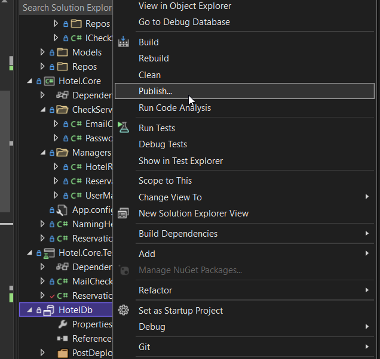
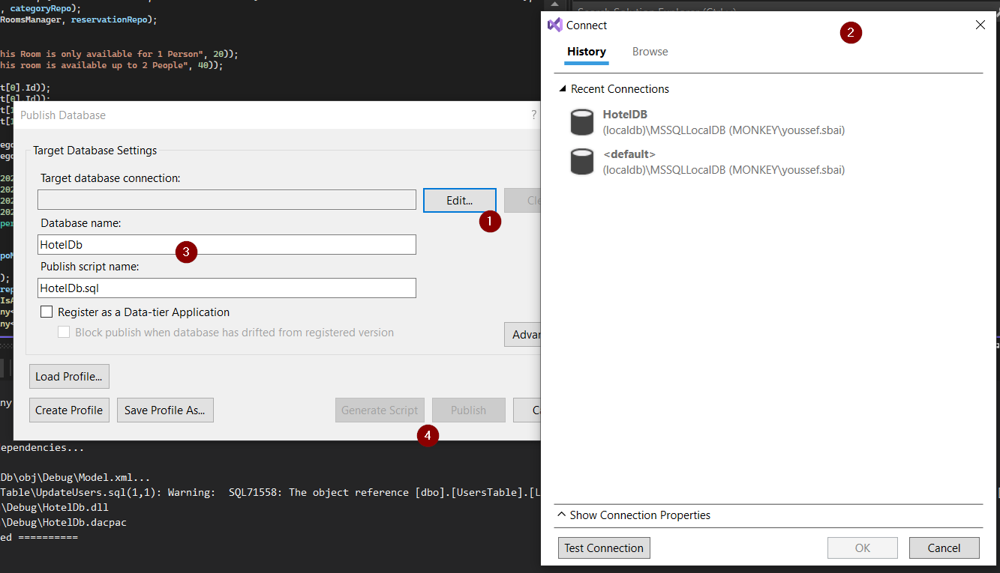

<!-- PROJECT LOGO -->
 

  

  <h3 align="center">Hotel Management App</h3>

  

    Next Level school Project!
     
    <a href="https://github.com/othneildrew/Best-README-Template"><strong>Explore the docs »</strong></a>
     
     
    <a href="https://github.com/youssefcamao/Hotel">View Demo</a>
    ·
    <a href="https://github.com/youssefcamao/Hotel/issues">Report Bug</a>
    ·
    <a href="https://github.com/youssefcamao/Hotel/issues">Request Feature</a>
  

<!-- GETTING STARTED -->
## Getting Started

1. Klicken Sie mit der rechten Maustaste auf die Datenbank und wählen Sie "Publish"

2. Wählen Sie die lokale Datenbank aus oder kopieren den connection string hinein
3. Vergeben Sie der Datenbank einen Namen und Skriptnamen
4. Klicken Sie dann auf Publish oder Generate Script, um das Template zu speichern.
5. Die Datenbank sollte nun nutzbar sein. Sollte es nicht nach dem ersten Durchgang gehen. Führen Sie die Schritte von 1 nochmal durch und wählen Sie erst Generate Script aus und danach Publish.
